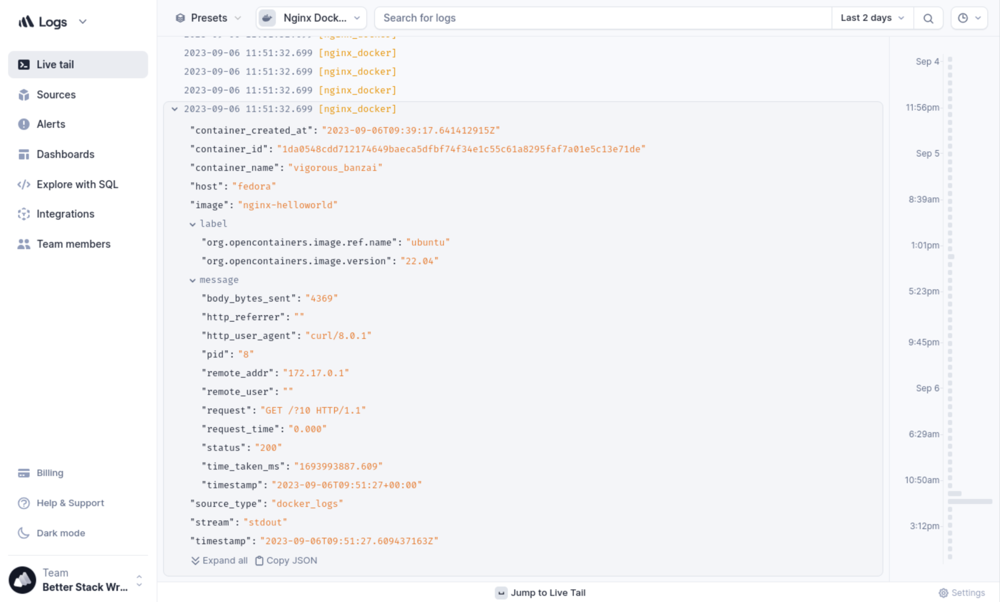

# Docker logging demo

This repo contains the configuration for a simple Nginx image built to
demonstrate logging in Docker.

**Tutorial**:
[Logging in Docker: Everything You Need To Know](https://betterstack.com/community/guides/logging/how-to-start-logging-with-docker/).



## 🟢 Prerequisites

- The latest version of Docker (tested with `v24.0.5`).

## 📦 Getting started

- Pull this image from
  [Docker Hub](https://hub.docker.com/r/betterstackcommunity/nginx-helloworld).

```bash
docker pull betterstackcommunity/nginx-helloworld:latest
```

- Create an run a container from the image on port 80:

```bash
docker run -p 80:80/tcp -d "betterstackcommunity/nginx-helloworld:latest"
```

- [Follow the tutorial](https://betterstack.com/community/guides/logging/how-to-start-logging-with-docker/)
  to learn more about managing Docker container logs in production.

## 🙏 Acknowledgements

- This repo is a derivative of
  [Karthik Gaekwad's original project](https://github.com/karthequian/docker-helloworld).

## ⚖ License

The code used in this project and in the linked tutorial are licensed under the
[MIT License](LICENSE).
